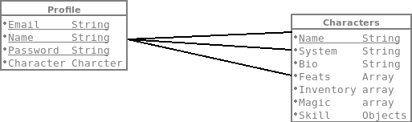

## Project 4 API

By Alvin Wong

## Project: Character Bank Api

This is a Api for the Client website that provides the abilty to store and get data from user. The data that is stored is user data , session and as well  as character data, as well get the data from  the user.

## Scope

This api is to provide the user sesion and data. As well as to provide the character data and store them. User will be a able to have a profile and see their stored character they made. User can also see the other character people have made on the website.

### Tools Used
    -javascript 
    -bcryptjs 
    -express.js 
    -node.js
    -mongodb
    -moongoose 
    -session

## Wireframes

